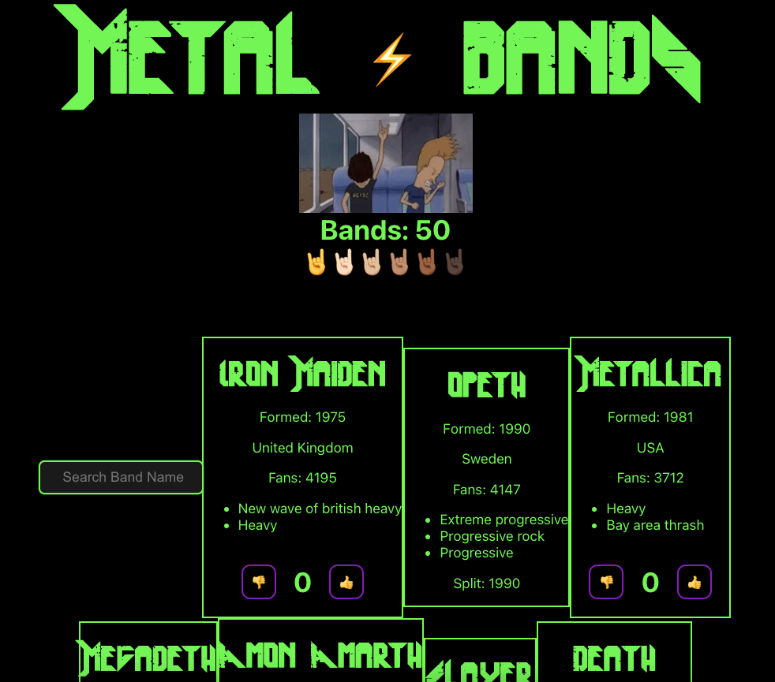
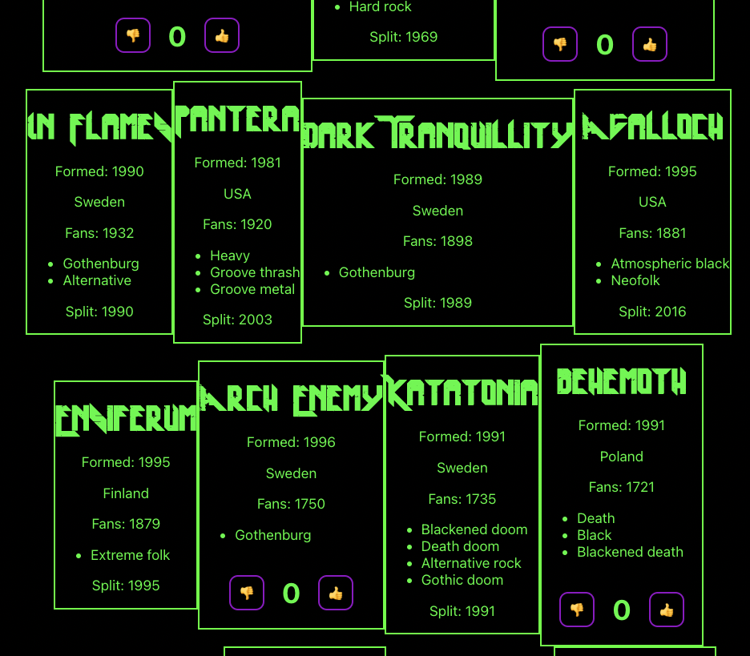

#Metal Bands React Project
This is a simple React web application that displays information about metal bands. 
The site allows users to search for bands by name and to "like" or "dislike" a band that is still together.

The project was built with React, utilizing components and state management to provide a seamless and dynamic user interface for a more intuitive experience.

## Features

- Displays a list of metal bands with their information
- Allows users to like or dislike a band
- Displays the number of likes a band has received
- Allows users to search for bands by name

## Screenshots

## Installation and Usage

1. Clone or download the repository.
2. Install the necessary dependencies by running npm install.
3. Start the development server by running npm start.
4. Open the app by navigating to http://localhost:3000 in a web browser.
    
## Contributing

Contributions are always welcome! If you have any suggestions or feature requests, feel free to submit a pull request or create a new issue.

## Tech Stack

**Client:** React, JavaScript, CSS

**Server:** Node

## Support

For support, email alexa.whitney@students.dominican.edu

